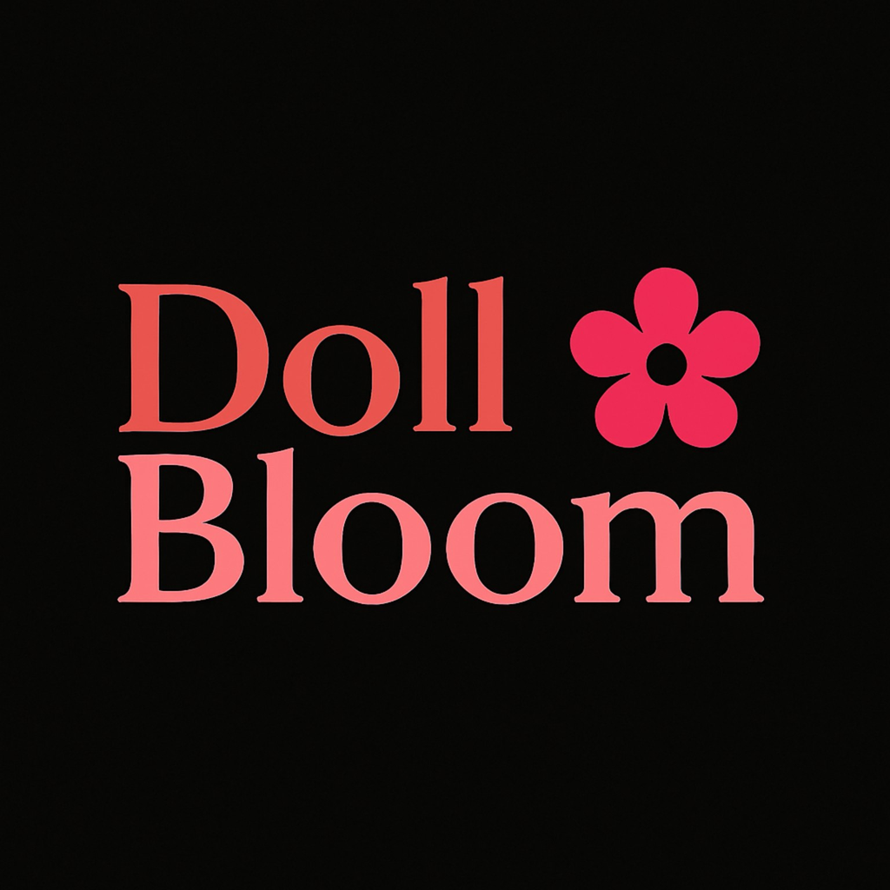
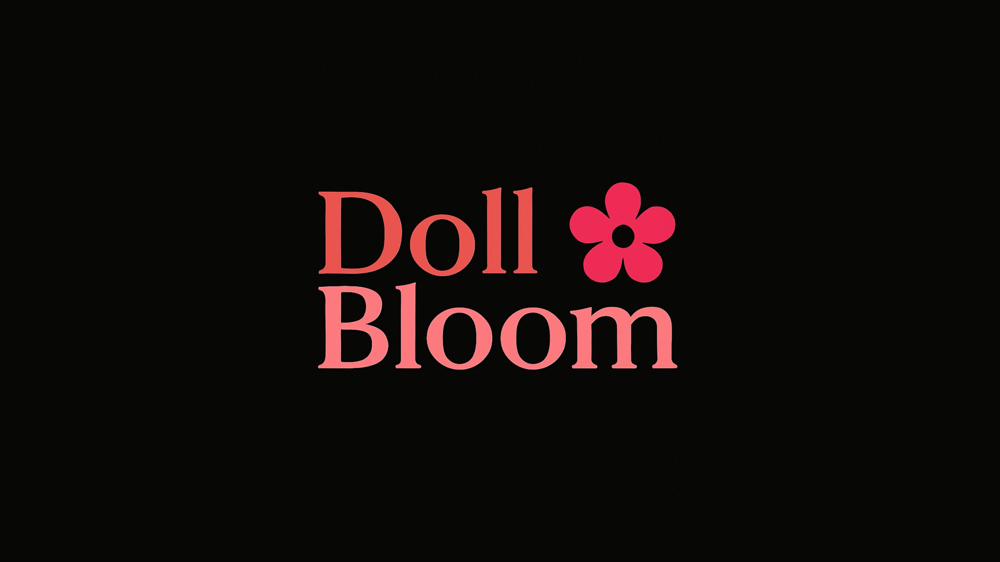

<div align="center">

<br/>
<br/>



# DollBloom 🌸

### Aesthetic YouTube Music Client

<br/>

[](https://github.com/DominatorStufs/DollBloom/releases)
[](https://github.com/DominatorStufs/DollBloom/blob/main/LICENSE)
[](https://github.com/DominatorStufs/DollBloom/releases)

<br/>

[**Download**](#download) · [**Features**](#features) · [**Contributing**](#contributing) · [**Support**](#support) · [**Disclaimer**](#disclaimer)

</div>

> [!IMPORTANT]
> DollBloom is not affiliated with, endorsed by, or connected to YouTube or Google in any way. Use it at your own discretion.

---

<div align="center">



<h1><a id="features"></a>Features</h1>

<table>
  <tr>
    <td width="50%" valign="top">

#### Playback
- **Search, browse and play** anything available on YouTube Music.
- **Hi-Res lossless audio** — FLAC/ALAC from a configured module source, with YouTube Music as fallback.
- **Gapless playback with true crossfade**, adjustable 0–12s.
- **Automix [Beta]** — DJ-style transitions with beat-matching and tempo-stretching.
- **Offline downloads** — save tracks with embedded metadata.
- **Local music library** integration.
- **Background playback** via a proper foreground media session.
- **Apple-like lyrics animation** — credit to [binimum](https://github.com/binimum/am-lyrics).

#### Experience
- **Animated album canvas** — motion artwork on the now-playing screen.
- **Word-synced lyrics** — word/syllable-level highlighting from multiple sources.
- **Dynamic, artwork-driven theming** — Material palette extracted from album art.
- **Frosted-glass UI** — translucent bars via Haze and Material 3 theming.

    </td>
    <td width="50%" valign="top">

#### Connectivity & Accounts
- **Sign in with your Google account** for personalized content.
- **Discord Rich Presence** — in-app login, live track/artist/album and progress.
- **Scrobbling** to Last.fm and ListenBrainz.
- **Pluggable sources** — add, edit, test and health-check module sources.

#### Controls & Tweaks
- **Per-network audio quality** — separate quality ceilings for Wi-Fi and mobile data.
- **Playback speed control** (0.5×–2.0×) and **skip silence**.
- **Sleep timer** — fixed presets or "stop after this track".
- **System equalizer** integration.
- **Stats for nerds** — codec, bit depth, sample rate, and more on the now-playing screen.

    </td>
  </tr>
</table>

</div>

---

<div align="center">

<h1><a id="download"></a>Download</h1>

Once a release is published, get the APK from [DollBloom Releases](https://github.com/DominatorStufs/DollBloom/releases). Sideloading requires enabling "Install unknown apps" for whichever app you download it with.

Repository maintainers can build manually from **Actions → Android Release Build → Run workflow**. Enter a positive, increasing version code and a version name (letters and numbers are supported, e.g. `1.8-beta2` or `DollBloom2026`). The workflow builds the minified production Release and uploads one universal APK as a 14-day artifact, provided it is at most 100 MB. Native libraries are compressed in the APK to reduce download size; no app features or supported ABIs are removed.

</div>

---

<div align="center">

<h1><a id="contributing"></a>Contributing</h1>

We welcome contributions to DollBloom! Please review our [Contributing Guide](CONTRIBUTING.md) and [Code of Conduct](CODE_OF_CONDUCT.md) before submitting a pull request.

[**Contributing Guide**](CONTRIBUTING.md) · [**Code of Conduct**](CODE_OF_CONDUCT.md) · [**Maintainers**](MAINTAINERS.md) · [**Additional Docs**](ADDITIONAL.md)

</div>

---

<div align="center">

<h1><a id="support"></a>Support</h1>

No DollBloom-specific donation links are configured yet. Support details can be added by the DollBloom maintainers later.

</div>

---

<div align="center">

<h1><a id="disclaimer"></a>Disclaimer & Legal Notice</h1>

DollBloom is an independent, community-driven third-party audio player and client. It is **not** associated with Google LLC, YouTube Music, Deezer, Telegram, or any of their parent companies.

* **No Media Hosting:** DollBloom does not host, upload, or store copyrighted music files. It operates strictly as an interface to scan local device storage or stream media directly from public, public-facing, or user-authenticated APIs.
* **Fair Use & API Usage:** This software is created solely for personal research, educational, and fair-use purposes. The user is entirely responsible for ensuring their usage aligns with their local copyright laws and YouTube Terms of Service.
* **No Ad-Blocking Guarantee:** DollBloom focuses on a clean listening environment but does not guarantee permanent bypasses or modifications to commercial third-party platform conditions.
* **Copyleft:** DollBloom is free software under the GPLv3. Any distribution must include the Corresponding Source under the same license.

</div>

---

<div align="center">

<h1><a id="license"></a>License</h1>

This project is licensed under the **GNU General Public License v3.0 (GPLv3)**. See the [LICENSE](LICENSE) file for details.

</div>

---

## Build locally

Requires JDK 17 and the Android SDK/NDK configured for this project.

```bash
./gradlew assembleDevDebug
./gradlew testDevDebugUnitTest
```

`LISTEN_TOGETHER_SERVER` can be set in `local.properties`, as an environment variable, or as the GitHub Actions repository variable of the same name for CI builds. If unset, the app still points at the original upstream Listen Together server, which is not DollBloom-hosted; configure your own backend and app-link domain before presenting those services as DollBloom-hosted.
